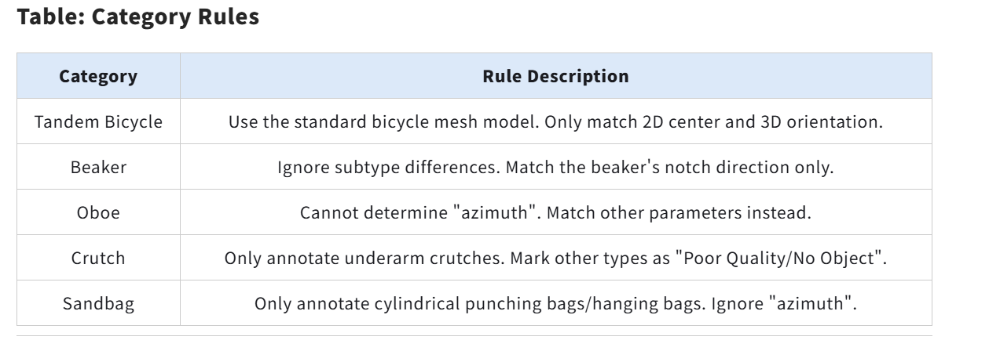

# 🖼️ImageNet3D Flask app
## 📖Notes on Using the Software and Solutions to Common Problems
### 📦Packages to install before running the program:

- Flask  
- numpy  
- matplotlib  
- pillow  
- opencv-python-headless  
- flask-login  
- You can also install the required Python packages in one go using the following command:
pip install Flask numpy matplotlib pillow opencv-python-headless flask-login
 

When in use, a folder named "imagene3dstorage" will be created in the current directory.   
In the next-level directory of this folder, there will be an empty SQLite file with 0 bytes.  
You can replace its content with that of the "daatabasse_default.ssqlite" file in the software's root directory to use it normally.  
The software 'Navicat Premium' can be used for replacement.  
The file distribution is as follows:
## Repository Structure
'''
📁 ImageNet3D-Flask-app/
├── 📁 static/
│   ├── 📁 images/
│   ├── 📁 tmp/
├── 📁 templates/
│   ├── login.html
│   ├── account.html
│   ├── test.html
│   ├── index.html
│   ├── eval.html
│   ├── quality.html
│   ├── doc.html
├── app.py
├── config.py
├── render.py
├── database.sqlite
├── database_default.sqlite
├── README.md
├── README.zh.md
├── requirements.txt
└── 📁 logs/
'''
 
<!-- by zhouxinian 2206302240333  The file distribution is as follows-->

## 📓Overview
In the previous assignment we looked into synthetic images generated by diffusion models that come with pseudo 3D annotations<a href="#ref1">[1]</a>. We found that about 75% of the synthetic images are consistent with the pseudo 3D annotations while the other 25% have inconsistent viewpoint or shape. Although as a synthetic dataset it is a little noisy, we have shown that NMMs<a href="#ref2">[2]</a> can effectively learn from the "good" samples and boost performance on both in-distribution and out-of-distribution data. 

This opens many new opportunities for 3D understanding (e.g., grounding, detection, segmentation) -- models can be built on knowledge learned by existing LLMs and generative diffusion models. However, to analyze the performance of such models, we still need to develop a dataset with accurate 3D annotations to evaluate the zero-shot/few-shot performance of such models. 

**How do we describe an object in the 3D space?** In this project, we specify the 3D viewpoint of the object (see image below), the 2D location of the object (in the image plane), and the distance from the camera to the object. These six parameters allows us to fully specify the 3D location and 3D rotation of the object. Moreover, we are also interested in which subtype of the object is in the image -- if it is a car, is it a sedan or a hatchback. This is accomplished by associating the object with a best matching mesh model from a list of models given (you will see all the mesh models available in the bottom right corner of the annotation page). 

Lastly every real image comes with an existing annotation obtained from a pretrained 3D model. Your job would be refining the prediction of the model, as well as labeling the quality of the object. See below for a full list of "things to do" for each real image. 

**❗Read me ☺ → Before you start, it is very important for you to go over this [tutorial](https://drive.google.com/file/d/1BiQ4CoYbhABI5S2oC0M7IGqqvUmosnmu/view) with qualitative examples demonstrating many important details. The first part of the tutorial is similar to this documentation and the second part of the tutorial provides a lot of qualitative images. Please go over a number of the examples in part two to make sure you fully grasp the idea.**  

## ⚙️New for v2 (Mar 2024)
1.As we start to deal with more challenging classes, we no longer have good initializations for the 3D orientation. New buttons are added with "↓↓" and "↑↑", which mean they are coarse buttons with bigger steps. 

2.Since we don't have good initializations, labeling one image may takes longer. Please be patient and make sure the results are visually correct. 

3.The quality of the images can be lower too -- some bounding boxes may not correspond to the class of interest. It is therefore important to label and disregard "bad" objects. Label the question as "bad quality/no object" so we will disregard this sample. In this case, you may skip tuning other parameters. 

4.Similar as before, it is important to label the visibility and the scene density. If you have gone through the [tutorial](https://drive.google.com/file/d/1BiQ4CoYbhABI5S2oC0M7IGqqvUmosnmu/view), you should have a good feeling of how to label these questions. 

### 🎨Some other class-specific notes: 

- **bicycle-built-for-two:** We don't have good mesh models for tandem bicycles so we will be using mesh models of normal bicycles. This shouldn't be a problem as long as you match the 2D center and 3D orientation of the tandem bicycle in the image and the rendered mesh model. 

- **beaker:** There are different subtypes of beakers but we don't have good mesh models covering every shape. This wouldn't be a problem for the pose parameters we consider here. For 3D viewpoint, match the orientation of the beaker notch. 2D location and distance should be straightforward too. 

- **oboe:** It's almost impossible to tell the "azimuth" of an oboe. Just ignore this parameter and match the others. 

- **crutch:** There can be different types of crutches (see [here](https://www.physio-pedia.com/File:Types_of_crutches.jpg)). We only want the type that matches the mesh model we have (i.e., axillary crutch). For other types of crutches, just label them as "bad quality/no object". 

- **punching_bag:** There are different types of punching bags (see [here](https://img2.storyblok.com/1800x743/filters:focal(null):format(webp)/f/115220/2400x990/eae71daccc/how-to-choose-the-right-punching-bag-for-your-workout.jpeg)). We only want boxing bag and hanging bags, with a cylinder shape. For punching bags, also ignore the "azimuth" parameter. 
Please see the table below:

<!-- by zhouxinian 2206302240333  rules_1-->

## 🤖Uesr Interface
Log in to the web app with your annotator ID. You will see the list of tasks assigned to you and track your progress in this page. 

Clicking on a task will redirect you to the first unannotated question. On the top you will see basic information about this question, as well as multiple control buttons. Hovering on the buttons will show you what they do. 

- Move between questions with "<", ">", or ">>". 

- Delete current saved/unsaved annotation with the yellow reverse button. 

- Save the current annotaion with the green save button. (Or hit "Enter" as shortcut.) 

The list of different CAD models are visualized on the bottom. Besides the 6D pose and type of model, you will also answer two questions on object quality and scene density. 

After labeling all information, clicking the green save button or pushing "Enter" key to save the annotation. If successful, you will see a message and the question status will be lighted. 

## 🧭Guidelines
**Matching mesh model (with initializations provided by a pretrained model).** The best matching model from a list of mesh models given. This is crucial to make accurate estimations of the following parameters so this should be the first thing to do. Click on "<- Model" and "Model ->" buttons to change the mesh model selection. 

**3D rotation (with initializations provided by a pretrained model).** Three parameters are used to specify the 3D rotation of an object: azimuth, elevation, and in-plane rotation (theta). Adjust the three parameters so the 3D rotation of the rendered object aligns with the 3D rotation of the object in the image. Make sure you are not simply aligning the segmentation or boundaries of the two objects. You should focus on aligning the 3D rotation of the objects so the rendered object is "pointing" to the same direction as the object in the image. 

**2D location (with initializations provided by a pretrained model).** 2D location specifies the location of the center of the object. 

**Distance (with initializations provided by a pretrained model).** Distance between the object and the camera. To annotate the distance, make sure the "size" of the rendered object is roughly the same as the "size" of the object in the image. 

**Object quality.** Object quality specifies how clearly the object is visible from the image. A "good" object would be clearly visible and not occluded. A "bad" object may be barely visible (imaging drving in heavy fog when cars in front of you are barely visible) or occluded by other objects. Several choices are considered: 

- Good. Most part (more than 90%) of the object is clearly visible in the image. 
- Partially visible. A small part of the object is occluded by other objects or outside the image (truncated by image boundary). 
- Barely visible. only a small part of the object is clearly visible -- the other parts are either occluded or outside the image, or barely visible due to other reasons (e.g., weather). 
- Bad quality / no object. Most part of the object is occluded or outside the image; or the pose of the object is very hard to tell. 
**Dense scene.** This parameter tells if an object is very close to another object from the same category. Here "close" is defined in the 2D image plane -- two objects are close if the distance between them is small in the 2D image plane. 

- Not dense scene. The object is not close to another object from the same category. There can be multiple objects from the same category in one image but the objects are far away from each other. 
- Dense scene. The object is very close to another object from the same category. They may occlude each other or simply very close to each other. 
Please see the table below:

<!-- by zhouxinian 2206302240333  parameter_annotation_details_1-->

## 🌰Examples
See [tutorial](https://drive.google.com/file/d/1BiQ4CoYbhABI5S2oC0M7IGqqvUmosnmu/view). 

## 📚References

[1] [Adding 3D Geometry Control to Diffusion Models](https://arxiv.org/abs/2306.08103) 
 

[2] [Robust Category-Level 6D Pose Estimation with Coarse-to-Fine Rendering of Neural Features](https://arxiv.org/abs/2209.05624) 
 
<!-- by zhuang xin jian 2205308040315 -->

Brief explanation：
Instructions
Installation of Packages
Before starting, you need to install the following packages: Flask, numpy, matplotlib, pillow, opencv-python-headless, and flask-login. You can install them all at once with the command: pip install Flask numpy matplotlib pillow opencv-python-headless flask-login.

When the program runs, it will create an imagenet3dstorage folder in the current directory. There will be an empty sqlite file in the subfolder. You just need to replace its content with that of the database_default.sqlite file in the root directory of the software. If you don't know how to replace it, you can use the Navicat Premium software.

The file structure is as follows:

        
复制代码
ImageNet3D-Flask-app/
├── static/
│   ├── images/
│   ├── tmp/
├── templates/
│   ├── login.html
│   ├── account.html
│   ├── test.html
│   ├── index.html
│   ├── eval.html
│   ├── quality.html
│   ├── doc.html
├── app.py
├── config.py
├── render.py
├── database.sqlite
├── database_default.sqlite
├── README.md
├── README.zh.md
├── requirements.txt
└── logs/

    
Overview
In previous studies, synthetic images with pseudo-3D annotations were researched, and about 75% of them met the annotations, while the rest had issues with viewing angles or shapes. Although the dataset has some noise, NMMs can learn from it and improve performance. This offers new opportunities for 3D understanding, but an accurately 3D-annotated dataset is needed to evaluate the models. This project describes objects through some parameters and also pays attention to subtypes. Each real image has pre-trained annotations, and you need to improve the predictions and annotate the quality. Make sure to read the tutorial before starting.

v2 Update (March 2024)
New coarse adjustment buttons are added because the initial 3D direction setting is not ideal when dealing with difficult categories.
The annotation process may take longer, so be patient and ensure the visual accuracy.
The image quality may be low. For "bad" objects, annotate and ignore them, and you can skip adjusting other parameters.
Annotating visibility and scene density is still important.
Category-Specific Notes
Tandem Bicycle: Use the ordinary bicycle model and ensure the 2D center and 3D direction match.
Beaker: Match the 3D viewpoint by the direction of the beaker's notch, and other parameters are simple.
Accordion: Ignore the "azimuth" and match other parameters.
Crutches: Only annotate the underarm crutches type, and mark others as "poor quality/no object".
Sandbag: Only annotate the punching bags and hanging bags (cylindrical), and ignore the "azimuth".
User Interface
Log in with your ID to see the task list and track your progress. Click on a task to jump to the first unannotated issue. There are information and buttons at the top. You can switch between issues, undo, and save (pressing Enter also saves). At the bottom, there is a list of CAD models. Besides model parameters, you also need to answer questions about quality and scene density. After saving successfully, you will get a prompt and the status will light up.

Guide
Matching Grid Model: Choose the best matching model from the list. It's very important and should be done first. Click the buttons to change the model.
3D Rotation: Use three parameters to adjust so that the 3D rotation of the rendered object aligns with that of the image object, not just aligning the segmentation or boundaries.
2D Position: Determine the center position of the object.
Distance: When annotating, make the size of the rendered object similar to that of the image object.
Object Quality: Divided into "good", "partially visible", "almost invisible", and "poor quality/no object".
Dense Scene: Divided into "non-dense" and "dense", judged by the distance between objects of the same category in the 2D plane.
Example
See the tutorial.

References
[1] Adding 3D Geometric Control in Diffusion Models
[2] Robust Category-Level 6D Pose Estimation Based on Neural Feature Coarse-to-Fine Rendering

<!-- by zhouxinain 2206302240333 -->