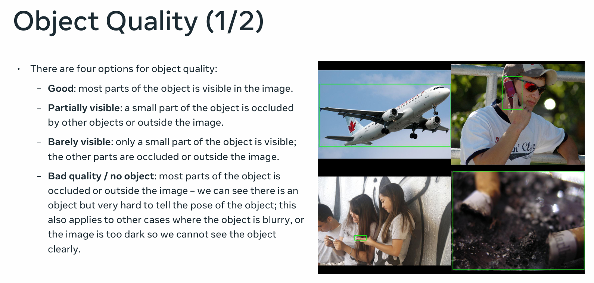
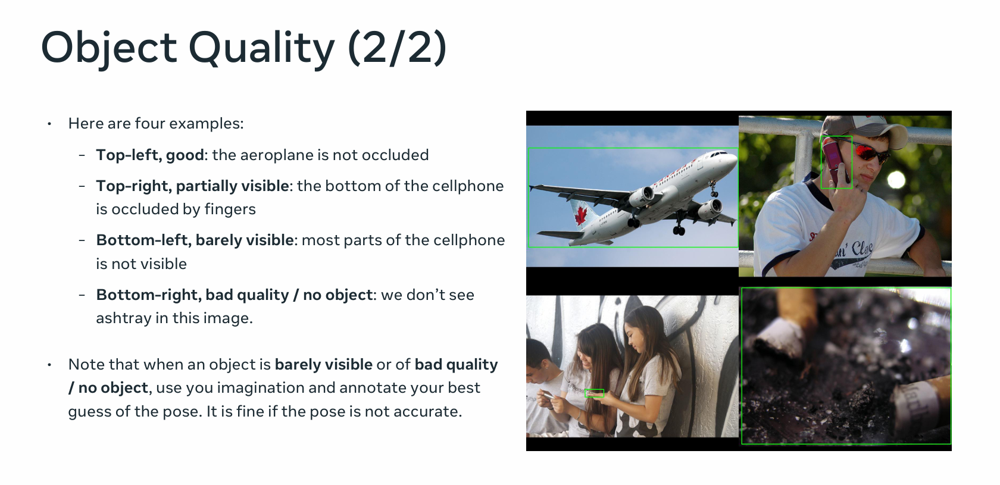

# 🖼️ImageNet3D Flask app
# 一、项目背景与意义
在计算机视觉领域，3D 理解一直是个热门又有挑战性的研究方向。这几年深度学习快速发展，基于扩散模型生成的合成图像自带伪 3D 注释，乍一看，好像给 3D 研究找到了新的数据 “石油田”，能帮我们更方便地研究物体在三维空间里的样子。 

ImageNet3D Flask 项目正是基于上述需求而产生，旨在构建一个高质量的 3D 注释数据集。该数据集主要用于评估基于大语言模型（LLMs）与生成扩散模型所构建的 3D 理解模型，在零样本或少样本场景下，其物体定位、检测、分割等核心功能的实际表现。 

举例来说，在物体定位任务中，通过该数据集的测试，能够检验模型在缺乏大量标注数据的情况下，对物体三维空间位置判断的准确性；在物体检测任务里，则可考察模型对场景中不同物体的识别效率与精准度。 

现在很多前沿领域都离不开 3D 视觉技术，比如自动驾驶，车辆得通过 3D 理解技术快速识别路上的行人、车辆和障碍物； 
还有虚拟现实，想让用户有身临其境的感觉，场景和物体的 3D 呈现必须足够真实； 
机器人感知也一样，准确的 3D 数据能帮机器人更好地理解周围环境，完成复杂的操作。 

通过精确标注物体在 3D 空间里的位置、旋转角度、尺寸大小这些属性，就能给相关研究提供高质量的数据支撑。 
<!--郭武权-->
## 📖使用软件注意事项以及解决方法
### 📦启动程序前所需安装的包：

- Flask  
- numpy  
- matplotlib  
- pillow  
- opencv-python-headless  
- flask-login  
- 也可以一步到位使用以下命令安装所需Python包:pip install Flask numpy matplotlib pillow opencv-python-headless flask-login
<!-- by zhouxinain 2206302240333 一键下载-->
 

使用时会在当前目录创建imagene3dstorage文件夹，  
在此文件夹的下一层目录中会有空的sqlite且字节为0的文件，  
可将内容替换为软件根目录下的‘daatabasse_default.ssqlite’的内容即可正常使用。  
如对替换所需的软件感到困惑，可使用软件‘Navicat Premium’进行替换。  
文件分布如下：
## Repository Structure
'''
📁 ImageNet3D-Flask-app/
├── 📁 static/
│   ├── 📁 images/
│   ├── 📁 tmp/
├── 📁 templates/
│   ├── login.html
│   ├── account.html
│   ├── test.html
│   ├── index.html
│   ├── eval.html
│   ├── quality.html
│   ├── doc.html
├── app.py
├── config.py
├── render.py
├── database.sqlite
├── database_default.sqlite
├── README.md
├── README.zh.md
├── requirements.txt
└── 📁 logs/
'''
 
<!-- by zhouxinain 2206302240333  文件目录结构 -->

## 📓概述

在上一个任务中，我们研究了由扩散模型生成的带有伪 3D 标注的合成图像<a href="#ref1">[1]</a>。我们发现约 75% 的合成图像与伪 3D 标注一致，而其余 25% 的图像存在视角或形状不一致的情况。尽管作为合成数据集存在一些噪声，但我们已经证明，NMMs<a href="#ref2">[2]</a> 能够有效地从“良好”的样本中学习，并在分布内和分布外的数据上提升性能。 

这为 3D 理解（例如，定位、检测、分割）开辟了许多新的机会——模型可以基于现有 LLM 和生成扩散模型所学到的知识来构建。然而，为了分析此类模型的性能，我们仍需开发一个具有准确 3D 标注的数据集，以评估这些模型的零样本/少样本性能。 

**我们如何描述三维空间中的一个物体？** 在这个项目中，我们指明物体的三维视角（见下图），物体在图像平面中的二维位置以及相机到物体的距离。这六个参数能够让我们完整地确定物体的三维位置和三维旋转。此外，我们还对图像中的物体属于哪种子类型感兴趣——如果它是汽车，是轿车还是掀背车。这是通过将物体与给定模型列表中的最佳匹配网格模型相关联来实现的（您将在注释页面的右下角看到所有可用的网格模型）。 

最后，每张真实图像都附带有一个来自预训练 3D 模型的现有注释。您的工作是完善模型的预测，并标注物体的质量。请参见下面每张真实图像的“待办事项”完整列表。 
<!-- 潘钟贤 --> 

**❗阅读我 ☺ → 在开始之前，您务必仔细阅读本[教程](https://drive.google.com/file/d/1BiQ4CoYbhABI5S2oC0M7IGqqvUmosnmu/view)，其中包含许多重要细节的定性示例。教程的第一部分与本文档类似，第二部分提供了大量定性图片。请仔细查看第二部分中的多个示例，以确保您完全理解其理念。**  

 

## ⚙️v2 版本更新（2024 年 3 月）
1.随着我们开始处理更具挑战性的类别，对于 3D 方向的初始设置不再理想。新增了带有“↓↓”和“↑↑”的按钮，这意味着它们是步长更大的粗调按钮。 

2.由于初始设置不佳，标注一张图片可能需要更长时间。请耐心等待，并确保结果在视觉上是正确的。 

3.图片质量也可能较低——一些边界框可能与感兴趣的类别不对应。因此，标注并忽略“不良”对象非常重要。将问题标记为“质量差/无对象”，这样我们会忽略此样本。在这种情况下，您可以跳过调整其他参数。 

4.与之前类似，标注可见性和场景密度仍然很重要。如果您已经完成了[教程](https://drive.google.com/file/d/1BiQ4CoYbhABI5S2oC0M7IGqqvUmosnmu/view)，应该对如何标注这些问题有很好的感觉。 

### 🎨其他类别特定的注意事项： 

- **双人自行车：** 我们没有双人自行车的良好网格模型，所以我们将使用普通自行车的网格模型。只要您在图像中的双人自行车的 2D 中心和 3D 方向与渲染的网格模型相匹配，这就不应成为问题。 
- **烧杯：** 烧杯有不同的子类型，但我们没有涵盖每种形状的良好网格模型。对于这里考虑的姿势参数，这不会成为问题。对于 3D 视点，请匹配烧杯缺口的方向。2D 位置和距离也应该很简单。 
- **双簧管：** 几乎不可能判断双簧管的“方位角”。只需忽略此参数并匹配其他参数。 
- **拐杖：** 拐杖有不同的类型（见[此处](https://www.physio-pedia.com/File:Types_of_crutches.jpg)）。我们只想要与我们拥有的网格模型匹配的类型（即腋下拐杖）。对于其他类型的拐杖，请将其标记为“质量差/无对象”。 
- **沙袋：** 沙袋有不同的类型（见[此处](https://img2.storyblok.com/1800x743/filters:focal(null):format(webp)/f/115220/2400x990/eae71daccc/how-to-choose-the-right-punching-bag-for-your-workout.jpeg)）。我们只想要拳击袋和悬挂袋，呈圆柱形。对于沙袋，也忽略“方位角”参数。 
<!-- by pengyaoqing 2205308040322 -->

- 如表：

<!-- by zhouxinain 2206302240333 表2206302240333 -->

## 🤖用户界面
使用您的注释员 ID 登录网络应用程序。您将在此页面看到分配给您的任务列表，并跟踪您的进度。 

点击一项任务将跳转至第一个未标注的问题。在顶部您会看到有关此问题的基本信息以及多个控制按钮。将鼠标悬停在按钮上会显示它们的功能。 

- 使用“<”、“>”或“>>”在问题之间切换。 
- 点击黄色的撤销按钮删除当前已保存或未保存的注释。 
- 点击绿色的保存按钮保存当前注释。（或者按“Enter”键作为快捷方式。） 

不同 CAD 模型的列表显示在底部。除了模型的 6D 姿态和类型外，您还需要回答关于物体质量和场景密度的两个问题。 

标注完所有信息后，点击绿色的“保存”按钮或按“Enter”键保存注释。如果成功，您将看到一条消息，问题状态也会亮起。 

### 指导说明
1. **匹配网格模型**（由预训练模型提供初始化）：从给定的网格模型列表中选择最匹配的模型。这对于准确估计以下参数至关重要，所以这应该是首先要做的事情。点击“<- 模型”和“模型 ->”按钮来更改网格模型的选择。
2. **三维旋转**（由预训练模型提供初始化）：使用三个参数来指定物体的三维旋转：方位角、仰角和平面内旋转（θ）。调整这三个参数，使渲染物体的三维旋转与图像中物体的三维旋转对齐。确保你不是简单地对齐两个物体的分割部分或边界。你应该专注于对齐物体的三维旋转，以便渲染物体与图像中的物体“指向”相同的方向。
3. **二维位置**（由预训练模型提供初始化）：二维位置指定物体中心的位置。
4. **距离**（由预训练模型提供初始化）：物体与相机之间的距离。在标注距离时，确保渲染物体的“大小”与图像中物体的“大小”大致相同。
5. **物体质量**：物体质量指明从图像中物体可见的清晰程度。一个“优质”的物体清晰可见且未被遮挡。一个“劣质”的物体可能几乎看不见（想象在大雾中驾驶时，前方的汽车几乎看不见的情况）或者被其他物体遮挡。有以下几种情况需要考虑：
    - **优质**：图像中物体的大部分（超过90%）清晰可见。
    - **部分可见**：物体的一小部分被其他物体遮挡或者在图像之外（被图像边界截断）。
    - **几乎不可见**：物体只有一小部分清晰可见——其他部分要么被遮挡，要么在图像之外，或者由于其他原因（例如天气）几乎看不见。
    - **质量差/无物体**：物体的大部分被遮挡或者在图像之外；或者物体的姿态很难判断。
6. **密集场景**：这个参数用于判断一个物体是否非常接近同一类别的另一个物体。这里“接近”是在二维图像平面中定义的——如果在二维图像平面中两个物体之间的距离很小，则认为它们接近。
    - **非密集场景**：该物体不接近同一类别的另一个物体。在一张图像中可能有多个同一类别的物体，但这些物体彼此相距较远。
    - **密集场景**：该物体非常接近同一类别的另一个物体。它们可能相互遮挡，或者只是彼此非常接近。
    - 如下表：
    
    <!-- by zhouxinain 2206302240333 表2206302240333_4 -->

### 对比总结
|参数类别|具体操作或判断标准|
|--|--|
|匹配网格模型|从给定列表选最佳匹配模型，通过特定按钮更改选择|
|三维旋转|用方位角、仰角和平面内旋转参数调整，使渲染物体与图像中物体三维旋转对齐，不单纯对齐分割或边界|
|二维位置|指定物体中心的位置，由预训练模型初始化|
|距离|确保渲染物体与图像中物体“大小”大致相同来标注物体与相机的距离，由预训练模型初始化|
|物体质量|优质：超90%清晰可见；部分可见：小部分被遮挡或在图像外；几乎不可见：仅小部分清晰可见，其余被遮挡或在图像外或因其他原因几乎不可见；质量差/无物体：大部分被遮挡或在图像外，姿态难判断|
|密集场景|非密集场景：物体不接近同类物体；密集场景：物体接近同类物体，可能相互遮挡或距离很近| 
<!-- 蒙霖昌 -->
 

## 🌰示例
### 物体质量评估标准
在本项目中，准确评估物体质量对于标注工作至关重要。我们将物体质量分为以下四个类别，每个类别都有明确的定义和示例，帮助您更好地理解和操作。
## 物体质量分类

Good（良好）：图像中物体的大部分（超过 90%）清晰可见，没有明显的遮挡情况。例如，左上方图片中的飞机，其机身完整呈现，几乎未被遮挡，属于此等级。 
Partially visible（部分可见）：物体有一小部分被其他物体遮挡，或者超出了图像的边界。如右上方图片所示，手机的底部被手指遮挡，这种情况就符合部分可见的标准。 
Barely visible（几乎不可见）：物体仅有极小部分清晰可辨，其余部分被遮挡或者在图像之外。就像左下方图片中的手机，大部分都看不到，属于几乎不可见的范畴。 
Bad quality /no object（质量差 / 无对象）：物体大部分被遮挡、超出图像范围，或者由于图像模糊、过暗等原因，难以判断物体的姿态。比如右下方的图片，无法看到烟灰缸，应标记为此等级。 
### 标注建议
当遇到几乎不可见或质量差 / 无对象的物体时，尽管难以精准判断其姿态，您仍需凭借经验和想象进行标注。请放心，标注的姿态不需要绝对精确。 
请参阅[教程](https://drive.google.com/file/d/1BiQ4CoYbhABI5S2oC0M7IGqqvUmosnmu/view)。 
<!--韦人玮 -->
### ImageNet3D 项目标注指南 - 以手机与水桶举例 
在 ImageNet3D 项目中，准确的标注对于数据质量至关重要。以下是手机和水桶两类物体的标注要点： 

手机 
CAD 模型覆盖：CAD 模型应能涵盖大多数手机对象。 
标记样本条件： 
当手机几乎不可见时，需标记样本。 
若仅手机的一小部分可见，要标记样本。 
若物体并非手机，同样需标记样本。 

水桶 
CAD 模型覆盖：CAD 模型应覆盖大多数水桶对象。 
模型匹配调整：若 CAD 模型与图像中的水桶不完全匹配（如图像中的水桶比 CAD 模型长一点），需确保两者的中心重合。目前许多标注将水桶上边缘对齐，而非中心对齐，需注意纠正。 
3D 旋转要求：要保证 3D 旋转正确，投影在图像上的 CAD 模型不必与图像中的水桶完全重叠。 
通过遵循这些标注规则，能有效提升 ImageNet3D 项目中数据标注的准确性与一致性，为后续的研究和应用提供可靠的数据基础。 

## 📚参考文献

[1] [在扩散模型中添加 3D 几何控制](https://arxiv.org/abs/2306.08103) 
 

[2] [基于神经特征粗到细渲染的鲁棒类别级 6D 位姿估计](https://arxiv.org/abs/2209.05624) 
 
<!-- by zhuang xin jian 2205308040315 -->

